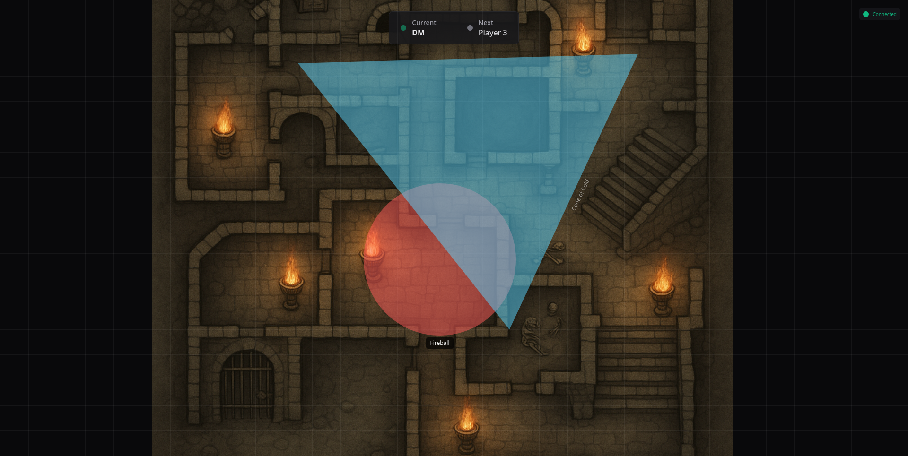
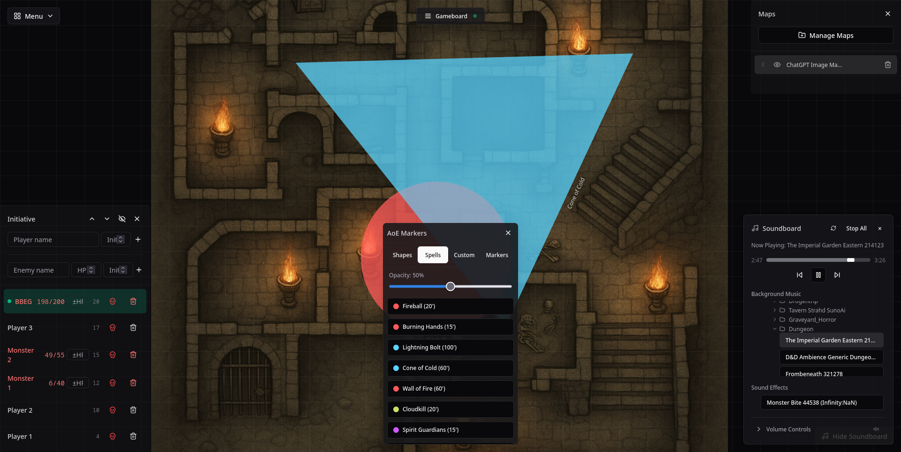
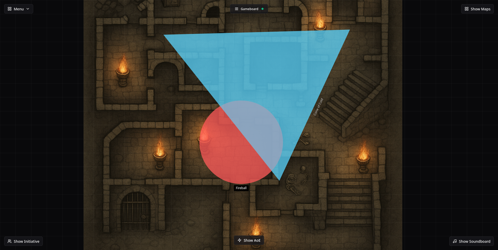
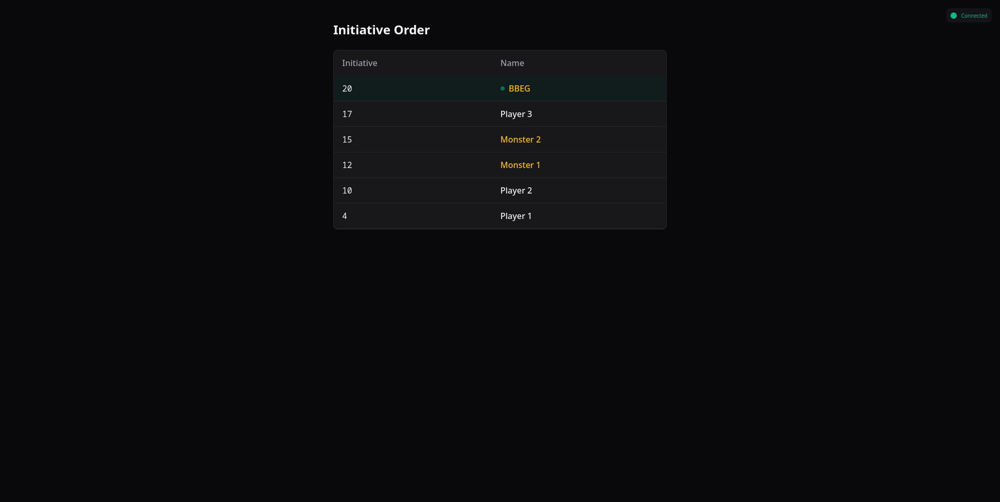

# SpellTable


A modern, local web-based virtual tabletop for in-person D&D sessions with a physical screen on the table. The Dungeon Master runs controls from a laptop while players see maps, fog of war, and effects on a large display (for example 4K).

## Screenshots

### Player view (TV / table display)



*Player-facing map with AoE markers and grid—intended for a TV or table screen.*

### Admin view (DM controls)



*Admin UI with initiative, AoE tools, soundboard, map management, and live preview.*

### Clean admin interface



*Same view with panels closed: map and grid unobstructed.*

### Initiative tracker



*Sortable initiative list for creatures and PCs.*

## Table of contents

- [Screenshots](#screenshots)
- [Features](#features)
- [Project status](#project-status)
- [Getting started](#getting-started)
- [Development](#development)
- [Contributing](#contributing)
- [License](#license)
- [About](#about)

## Features

### Virtual tabletop

- **Grid-aligned maps** on a large display with precise pan, zoom, and positioning
- **Dual views**: admin (full controls + preview) and **player** full-screen viewer
- **Initiative tracker** with a sortable list and dedicated `/initiative` page
- **Area of effect** markers (cones, circles, custom shapes) synced in real time
- **Fog of war** polygons on the map (author on admin, reveal on the player view)
- **Soundboard** for ambient tracks and one-shots
- **Map management**: upload, folders, scale, position, layers, and z-order
- **Hide / reveal** maps and overlays for dramatic pacing
- **Real-time sync** over Socket.IO so admin changes appear immediately on the viewer

### Campaigns and accounts

- **Sign-in** with JWT-based API auth; **admin** vs **viewer** roles
- **Campaigns** with membership; per-campaign **diary**, **markdown notes**, and **image gallery**
- **Tavern** tab: optional in-world business tracking (valuation, tendays, upgrades, ledger)—see campaign diary
- **Monster** library helpers for reference material tied to the backend
- **Backup** endpoints for exporting / restoring campaign-related data (admin)

### Planned / roadmap ideas

- Distance measurement and on-map rulers
- Camera-based mini tracking
- Richer animated effects (fire, fog, magic circles)
- Standalone player journal app
- Deeper combat automation

## Project status

### VTT core (stable)

- [x] Maps: upload, scale, position, layers, grid overlay
- [x] Initiative tracker with live updates
- [x] Admin and player views with Socket.IO sync
- [x] AoE markers
- [x] Soundboard
- [x] Fog of war regions on maps

### Campaigns and platform

- [x] SQLite database (configurable via `DATABASE_URL`) for users, campaigns, tavern state, etc.
- [x] Authentication and user management (admin-created accounts)
- [x] Campaign diary, notes, images, and tavern mechanics
- [x] Docker Compose layout for local or server deployment

Enhancements in progress or planned include UI polish for touch tables, measuring tools, and the items listed under [Planned](#planned--roadmap-ideas).

## Getting started

### Prerequisites

- **Python 3.13** (see `backend/pyproject.toml` for the supported range)
- **[uv](https://docs.astral.sh/uv/getting-started/installation/)** for the backend virtualenv and dependencies
- **Node.js** (LTS recommended) and **npm**

### Quick start

1. Clone the repository:

   ```bash
   git clone https://github.com/paulpaul168/spelltable.git
   cd spelltable
   ```

2. Start backend and frontend (see `run.sh`; it installs frontend deps and runs both processes):

   ```bash
   chmod +x run.sh   # once
   ./run.sh
   ```

3. **First-time database seed** (creates default users and sample campaigns). From another terminal, with dependencies installed:

   ```bash
   cd backend
   uv sync --extra dev
   uv run python init_db.py
   ```

   Default accounts (change these in production):

   | User     | Password   | Role   |
   |----------|------------|--------|
   | `admin`  | `admin123` | Admin  |
   | `viewer` | `viewer123`| Viewer |

4. Open the app:

   | URL | Purpose |
   |-----|---------|
   | [http://localhost:3000](http://localhost:3000) | Admin / gameboard (after login) |
   | [http://localhost:3000/login](http://localhost:3000/login) | Sign in |
   | [http://localhost:3000/viewer](http://localhost:3000/viewer) | Player display |
   | [http://localhost:3000/viewer/campaigns](http://localhost:3000/viewer/campaigns) | Campaign diary, notes, images, tavern (signed in) |
   | [http://localhost:3000/initiative](http://localhost:3000/initiative) | Initiative-only page |
   | [http://localhost:8010](http://localhost:8010) | Backend API (`/health`, `/docs`) |

**Tip:** Keep the admin UI on the DM machine and `/viewer` on the table display.

### Manual setup

**Backend**

```bash
cd backend
uv sync --extra dev
uv run uvicorn main:app --reload --host 0.0.0.0 --port 8010
```

**Frontend**

```bash
cd frontend
npm install
npm run dev
```

### Data and environment

- **Database**: By default SQLite lives at `data/spelltable.db` (repo root). Override with `DATABASE_URL` if you use another database supported by SQLAlchemy.
- **Docker**: `docker-compose.yml` mounts `./data`, `./maps`, `./scenes`, `./sounds`, `./campaign_images`, `./monsters`, and `./logs` into the backend—create these directories or rely on Compose as needed.

## Development

### Tech stack

- **Frontend:** Next.js (App Router), React 19, TypeScript, Tailwind CSS, Radix UI / shadcn-style components
- **Backend:** FastAPI, Uvicorn, Pydantic v2, SQLAlchemy, SQLite by default
- **Real time:** `python-socketio` / Engine.IO (see `backend/app/routes/websocket.py`)
- **Auth:** JWT (`python-jose`), password hashing (`passlib` / `bcrypt`)
- **Assets:** Filesystem storage for maps, scenes, audio, campaign images, and monster data; metadata and users in the database

### Project structure

```text
spelltable/
├── README.md
├── LICENSE.md
├── run.sh
├── docker-compose.yml
├── data/                    # SQLite DB (default path); gitignored
├── screenshots/
├── backend/
│   ├── main.py              # App factory and route registration
│   ├── init_db.py           # Tables + default users + sample campaigns
│   ├── app/
│   │   ├── core/            # config, database, auth, logging
│   │   ├── models/          # SQLAlchemy / Pydantic models
│   │   └── routes/          # auth, campaigns, scenes, maps, audio, websocket, …
│   ├── maps/ scenes/ sounds/
│   ├── pyproject.toml
│   └── Dockerfile
├── frontend/
│   ├── src/
│   │   ├── app/             # Next.js routes (login, viewer, initiative, …)
│   │   ├── components/      # UI and game components
│   │   ├── services/        # API + Socket.IO clients
│   │   ├── contexts/
│   │   ├── types/
│   │   └── lib/
│   ├── public/
│   ├── package.json
│   └── Dockerfile
└── .github/
```

### Z-index layering

Stacking is ordered roughly as: map layers (by list order), then active map boost, AoE above maps, grid above AoE, chrome UI (~1000), dialogs/menus (~10000), toasts above dialogs. Radix overlays are forced above map canvases so controls stay usable.

### Python tooling

```bash
cd backend
uv sync --extra dev
ruff check .
ruff format .
mypy .
pytest
```

### Frontend

```bash
cd frontend
npm run lint
```

### Commit messages

Use a **single subject line**, imperative mood, about 50 characters when practical (max 72). Optional **Conventional Commits** prefix: `feat`, `fix`, `chore`, `docs`, etc. No body required unless the change needs extra context.

**Examples:** `feat: add tavern ledger export`, `fix: sync viewer fog state`

## Contributing

By contributing, you agree your work is licensed under the same terms as the project (see [License](#license)).

1. Fork the repo and follow [Getting started](#getting-started).
2. Branch from `main`, make focused changes, run `pytest` and `npm run lint` where relevant.
3. Open a pull request with a short description and, for UI work, screenshots.

Report bugs via GitHub Issues with steps to reproduce and environment details.

## License

SpellTable is dual-licensed under the **GNU Affero General Public License v3 (AGPL v3)** and a **commercial license**. See [LICENSE.md](LICENSE.md). AGPL users must offer corresponding source to network users; commercial use without those obligations requires a separate agreement with the copyright holder.

## About

**SpellTable** blends spellcasting and a shared digital table for tech-assisted fantasy games. Built by friends for home games; contributions welcome.

For help, use GitHub Discussions or Issues.
