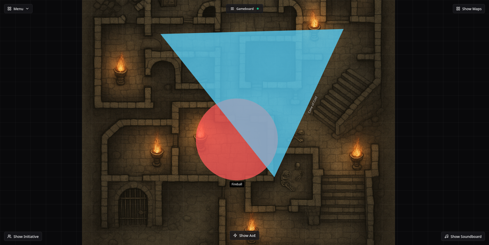

# 🔮 SpellTable


A modern, local web-based virtual tabletop designed for in-person D&D sessions with a physical screen on the table. Built to give Dungeon Masters full control while providing players with an immersive experience on a 4K display.

## 📸 Screenshots

### Player View (TV/Table Display)

*The main player view showing a dungeon map with AoE markers and grid overlay - perfect for displaying on a 4K TV or table screen*

### Admin View (Dungeon Master Controls)

*The comprehensive admin interface with initiative tracker, AoE markers, soundboard, map management, and real-time preview*

### Clean Admin Interface

*The clean admin interface with all menus and panels closed, showing the unobstructed map view with grid overlay*

### Initiative Tracker

*Clean, organized initiative order display showing players and monsters with their initiative values*

## 📋 Table of Contents

- [Screenshots](#-screenshots)
- [Features](#-features)
- [Project Status](#-project-status)
- [Getting Started](#-getting-started)
- [Development](#-development)
- [Contributing](#-contributing)
- [License](#-license)
- [About](#-about)

## ✨ Features

### Core Features

- **Grid-aligned map display** on a 4K TV with precise positioning
- **Dual-view system**: Admin view for Dungeon Master with map preview and controls, Player view for full-screen display (TV/table)
- **Initiative tracker** with sortable text-based list (see [Initiative screenshot](#initiative-tracker))
- **Area of Effect markers** with cones, circles, and custom templates (visible in [Player View](#player-view-tvtable-display))
- **Interactive soundboard** with ambient music and sound effects
- **Map management**: Load, scale, position, and layer multiple maps easily
- **Real-time synchronization** via WebSocket - changes in admin view instantly appear on player display
- **Hide/reveal maps** and elements at will for dramatic reveals
- **Multiple map layers** with proper z-index management

### Planned Features

- Distance measurement tools
- Camera-based mini tracking
- Animated effects (fire, fog, magic circles)
- Interactive rulers
- Fog of War / hidden regions
- Player journal web app

## 📊 Project Status

### MVP Checklist ✅

- [X] Upload and manage maps (scale, position)
- [X] Toggle grid overlay on maps
- [X] Initiative tracker (text-based list with sorting)
- [X] Separate Admin and Player views
  - [X] Admin preview mode with comprehensive controls
  - [X] Player full-screen display mode
- [X] Show/hide maps and overlays on player screen
- [X] Sync state via WebSocket (real-time updates)
- [X] Area of Effect markers (cones, circles, custom templates)
- [X] Interactive soundboard with ambient music
- [X] Multiple map layers with z-index management
- [X] Modern, touch-friendly UI design

*All core MVP features are complete and functional as shown in the screenshots above!*

### Development Roadmap

#### ✅ MVP Phase (Complete)

- ✅ Local web app (Next.js + FastAPI backend)
- ✅ Basic file system for storing maps and sessions
- ✅ UI for uploading and positioning maps
- ✅ Toggleable grid overlay
- ✅ Initiative order list with real-time updates
- ✅ Admin/Player view sync via WebSocket
- ✅ AoE Markers (cones, circles, custom templates)
- ✅ Interactive soundboard with ambient music
- ✅ Multiple map layers with proper z-index management

#### 🔵 Enhancement Phase (In Progress)

- [ ] Distance measuring tool
- [ ] Fog of War implementation
- [ ] UI polish for touch/table usage
- [ ] Advanced marker templates
- [ ] Session management improvements

#### 🔮 Future Phase

- [ ] Camera-based tracking for minis
- [ ] Automatic status/effect display
- [ ] Animated effects (fire, fog, magic circles)
- [ ] Player journal web app
- [ ] Multi-session management
- [ ] Advanced combat automation

## 🚀 Getting Started

### Prerequisites

- Python 3.x
- Node.js (latest LTS version recommended)
- npm or yarn

### Quick Start

1. Clone the repository:

   ```bash
   git clone https://github.com/paulpaul168/spelltable.git
   cd spelltable
   ```

2. Run the development servers:

   ```bash
   chmod +x run.sh  # Only needed once
   ./run.sh
   ```

3. Access the application:
   - Backend API: <http://localhost:8010>
   - Frontend: <http://localhost:3000>

#### Application Views

- **Admin View** (`http://localhost:3000`): Full DM interface with all controls (see [Admin screenshot](#admin-view-dungeon-master-controls))
- **Player View** (`http://localhost:3000/viewer`): Clean display for your TV/table (see [Player screenshot](#player-view-tvtable-display))
- **Initiative Tracker** (accessible from admin view): Manage turn order (see [Initiative screenshot](#initiative-tracker))

> **Tip**: Open the admin view on your laptop/DM screen and the player view on your TV or table display for the optimal setup!

### Manual Setup

#### Backend

```bash
cd backend
python -m venv
source .venv/bin/activate  # On Windows: .venv\Scripts\activate
pip install -r requirements-dev.txt
uvicorn main:app --reload --host 0.0.0.0 --port 8010
```

#### Alternative Backend Setup (using [uv](https://docs.astral.sh/uv/getting-started/installation/))

```bash
cd backend
uv sync --extra dev
source .venv/bin/activate  # On Windows: .venv\Scripts\activate
# Install uv if not already installed
uvicorn main:app --reload --host 0.0.0.0 --port 8010
```

#### Frontend

```bash
cd frontend
npm install
npm run dev
```

## 🧱 Development

### Tech Stack

- **Frontend:** Next.js (React, TailwindCSS)
- **Backend:** FastAPI (Python)
- **WebSocket:** `fastapi-socketio`
- **Local Storage:** JSON + static file storage
- **Deployment:** Local server (Synaptics SL1680, Raspberry Pi, laptop, etc.)

### Project Structure

```tree
spelltable/
├── README.md                # Project documentation
├── LICENSE.md               # Licensing information
├── run.sh                   # Development startup script
├── docker-compose.yml       # Docker container orchestration
├── screenshots/             # Application screenshots
│   ├── screenshot_viewer.png
│   ├── screenshot_admin.png
│   ├── screenshot_admin_clean.png
│   └── screenshot_ini.png
│
├── backend/                 # FastAPI backend
│   ├── main.py              # Application entry point
│   ├── app/                 # Core application code
│   │   ├── routes/          # API route handlers
│   │   ├── models/          # Pydantic data models
│   │   └── core/            # Core functionality
│   ├── maps/                # Uploaded map storage
│   ├── scenes/              # Scene/session data
│   ├── sounds/              # Audio files for soundboard
│   ├── requirements.txt     # Python dependencies
│   ├── requirements-dev.txt # Development dependencies
│   ├── pyproject.toml       # Python project configuration
│   └── Dockerfile           # Backend container config
│
├── frontend/                # Next.js frontend
│   ├── src/                 # Source code
│   │   ├── app/             # Next.js app router pages
│   │   ├── components/      # React components
│   │   ├── pages/           # Additional pages
│   │   ├── services/        # API service layer
│   │   ├── types/           # TypeScript type definitions
│   │   ├── lib/             # Utility libraries
│   │   └── config/          # Configuration files
│   ├── public/              # Static assets
│   ├── package.json         # Node.js dependencies
│   ├── tailwind.config.js   # Tailwind CSS configuration
│   ├── components.json      # UI component configuration
│   └── Dockerfile           # Frontend container config
│
└── .github/                 # GitHub workflows and templates
```

### Z-Index Layering System

SpellTable implements a structured z-index layering system to ensure proper stacking of UI elements, maps, and game features.

#### Layer Hierarchy

The following hierarchy is enforced through z-index values:

| Layer                | z-index                     | Description                                       |
| -------------------- | --------------------------- | ------------------------------------------------- |
| Maps                 | `maps.length - index`       | Maps are stacked based on order in the map list   |
| Active Map           | `maps.length - index + 100` | Selected map gets +100 to appear above other maps |
| AoE Markers          | `maps.length + 100`         | AoE markers always appear above all maps          |
| Grid Overlay         | `maps.length + 200`         | Grid is always above maps and markers             |
| UI Elements/Buttons  | `1000`                      | UI controls are fixed at z-index 1000             |
| Dialogs/Menus        | `10000`                     | Dialogs, dropdowns, and menus use z-index 10000   |
| Toasts/Notifications | `10001`                     | Highest z-index for notifications                 |

#### Implementation

- Maps receive dynamic z-indices based on their position in the map array
- Lower-positioned maps in the list appear on top (have higher z-index values)
- UI elements have fixed high z-index values to ensure they're always accessible
- The system ensures that no matter how many maps are added, UI elements remain accessible

#### Component-Specific Z-Indices

- **Dialog Components**: Override Radix UI's default z-index (50) with z-index 10000
- **Dropdown Menus**: Set to z-index 10000 to ensure they're above all map elements
- **Backdrops/Overlays**: Use z-index 9999 to dim the background without hiding dialogs

This z-index system ensures that:
1. Maps can be stacked and reordered as needed
2. UI controls and menus are always accessible and never hidden behind maps
3. Active elements (selected map, open dialog) appear on top of other elements

### Code Style Guidelines

#### Python (Backend)

- Follow PEP 8 style guide
- Use type hints
- Document functions with docstrings
- Keep functions small and focused

#### TypeScript/React (Frontend)

- Use functional components
- Follow ESLint rules
- Use TypeScript for type safety
- Keep components modular

### Code Quality

#### [uv](https://docs.astral.sh/uv/getting-started/installation/)

uv is a fast Python package installer and resolver written in Rust. It's used in this project for dependency management and virtual environment creation.

```bash
# Install dependencies and set up virtual environment
cd backend
uv sync --extra dev

# Install a new package
uv add package-name

# It also supports pip syntax
uv pip install package-name
```

#### [Ruff](https://docs.astral.sh/ruff/)

Ruff is an extremely fast Python linter and formatter, also written in Rust. It helps maintain code quality and consistency.

```bash
# Run linting
cd backend
ruff check .

# Run formatting
ruff format .
```

#### [mypy](https://mypy.readthedocs.io/)

mypy is a static type checker for Python that helps catch type-related errors before runtime.

```bash
# Run type checking
cd backend
mypy .
```

### Commit Message Format

```text
<type>(<scope>): <description>

[optional body]

[optional footer]
```

Types:

- feat: New feature
- fix: Bug fix
- docs: Documentation changes
- style: Code style changes
- refactor: Code refactoring
- test: Test changes
- chore: Maintenance tasks

## 👥 Contributing

### Important Note for Contributors

By contributing to this project, you agree that your contributions will be licensed under the AGPL v3 license. This means:

- Your contributions must be compatible with AGPL v3
- You retain copyright of your contributions
- You grant the project the right to use your contributions under AGPL v3
- You understand that your contributions may be used in commercial versions of the software

### Development Workflow

1. **Fork the Repository**

   ```bash
   git clone https://github.com/your-username/spelltable.git
   cd spelltable
   ```

2. **Set Up Development Environment**
   - Follow the [Quick Start](#-getting-started) guide
   - Ensure all tests pass before making changes

3. **Create a Feature Branch**

   ```bash
   git checkout -b feature/your-feature-name
   ```

4. **Make Your Changes**
   - Follow code style guidelines
   - Write clear commit messages
   - Add tests for new features
   - Update documentation

5. **Testing**

   ```bash
   # Backend tests
   cd backend
   pytest

   # Frontend tests
   cd frontend
   npm test
   ```

6. **Submit a Pull Request**
   - Push your branch to your fork
   - Create a PR to the main repository
   - Include:
     - Description of changes
     - Screenshots (if applicable)
     - Related issues
     - Testing performed

### Issue Reporting

1. Check for existing issues
2. Create a new issue with:
   - Clear title
   - Steps to reproduce
   - Expected vs actual behavior
   - Environment details
   - Screenshots (if applicable)

### Code of Conduct

- Be respectful and inclusive
- Give constructive feedback
- Be open to suggestions
- Help others learn

## 📜 License

SpellTable is dual-licensed under the GNU Affero General Public License v3 (AGPL v3) and a commercial license.

### Open Source License (AGPL v3)

- You may use, modify, and distribute the source code for free
- Any modifications must also be licensed under AGPL v3
- The source code must be made available to users
- You may not sell the software without a commercial license

### Commercial License

To obtain a commercial license for selling the software as a finished product, please contact the copyright holder. The commercial license grants you the right to:

- Sell the software as a finished product
- Use the software without AGPL requirements
- Receive additional features and support
- Customize the software for your needs

All rights not expressly granted under either license are reserved by the copyright holder.

For more details, see the [LICENSE.md](LICENSE.md) file.

## 🧙‍♂️ About

### The Name

**SpellTable** reflects the idea of combining spellcasting (D&D magic) with a literal "digital table" setup – perfect for a tech-enhanced fantasy experience.

### Contributors

Built by a group of friends for their in-person D&D games. Contributions welcome!

### Getting Help

- Ask questions in GitHub Discussions
- Review existing issues
- Check the documentation
